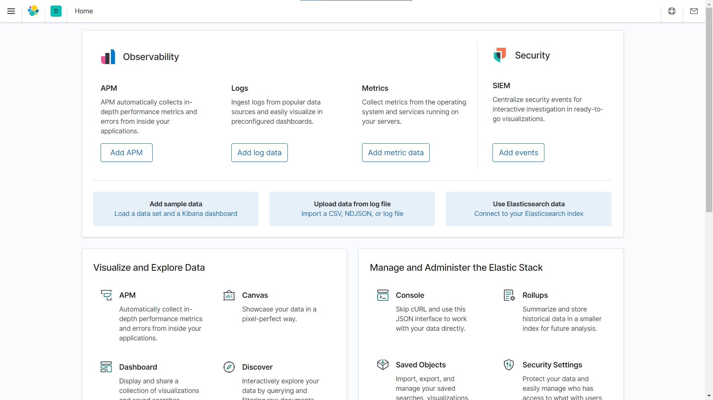

<div dir="rtl">

## Elasticsearch

<p align=center></p>

### 📝فهرست
  - مقدمه
  - معرفی Elastic Stack (ELK)
  - توزیع‌شدگی و مقیاس‌پذیری
  - نگاشت پویا (Dynamic mapping)
  - امکانات نرمال‌سازی
  - امکان ذخیره‌ی انواع مختلف داده‌ها
  - امکانات جستجوی پیشرفته
  - معرفی اصطلاحات
  - نصب و راه‌اندازی
  - بارگذاری اسناد
  - انواع مختلف داده
  - انواع و اقسام مختلف جستجو
  - ابزارهای آنالیز متن
  - پرسش‌های تجمیعی
  - آشنایی با bulk
  

### ✍️نویسندگان
  - [علیرضا تاجمیرریاحی](https://github.com/AlirezaT99)
  - [سپهر صفری](https://github.com/sepehrs1378)
  - [پرهام صارمی](https://github.com/parhamsaremi)
<hr>

<p align=center></p>

## نصب و راه‌اندازی
در این بخش به بررسی نحوه‌ی راه‌اندازی elasticsearchو kibana خواهیم پرداخت.
<br>
ابتدا از
[اینجا](https://www.elastic.co/downloads/elasticsearch)
و
[اینجا](https://www.elastic.co/downloads/kibana)
الستیک‌سرچ و کیبانا را نصب کنید. (یا از طریق apt و yum)
<br>
حال با اجرای
`bin/elasticsearch`
(یا `bin\elasticsearch.bat` در ویندوز) الستیک‌سرچ را اجرا کنید.
<br>
همچنین با اجرای
`bin/kibana`
(یا `bin\kibana.bat` در ویندوز) کیبانا اجرا می‌شود.
> تجربه: اگر روی ویندوز هستید بررسی کنید اسم فولدر حاوی فایل‌ها دارای اسپیس نباشد :|
<br>
الستیک‌سرچ بطور پیش‌فرض روی پورت 9200 اجرا می‌شود و با استفاده از

<div dir="ltr">
  
  ```bash
  curl http://localhost:9200/
  ```
</div>
می‌توانید از اجرا شدن آن مطمئن شوید.
<br>
همچنین kibana بطور پیش‌فرض روی پورت 5601 اجرا می‌شود و با رفتن به
http://localhost:5601
با صفحه‌ی زیر مواجه خواهید شد:
<br>
<p align=center></p>
<br>
اکنون می‌توانید از منوی سمت چپ صفحه در قسمت management وارد Dev Tools شوید تا به قسمت بعدی بپردازیم :)
</div>
