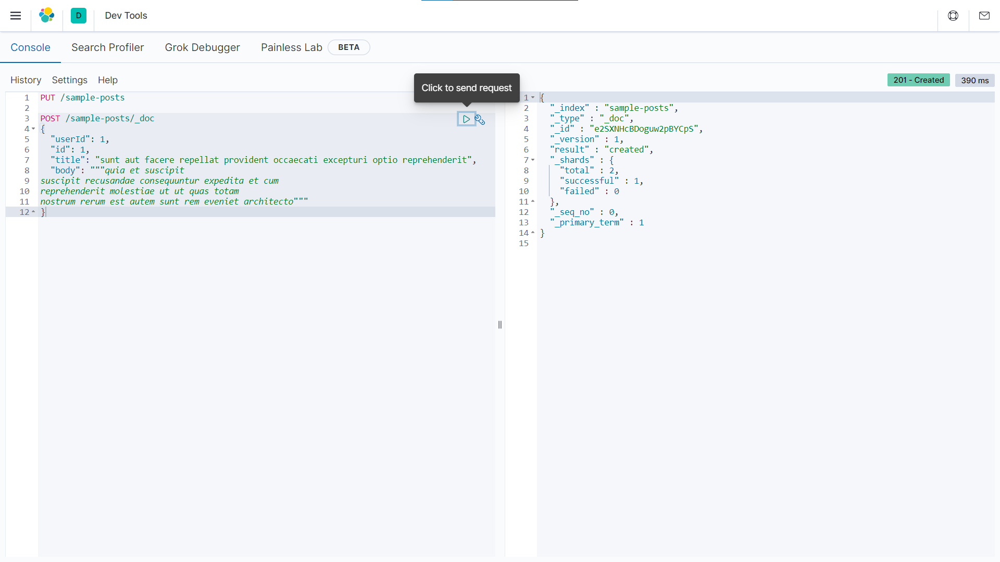

<div dir="rtl">

## Elasticsearch

<p align=center></p>

### 📝فهرست
  - مقدمه
  - معرفی Elastic Stack (ELK)
  - توزیع‌شدگی و مقیاس‌پذیری
  - نگاشت پویا (Dynamic mapping)
  - امکانات نرمال‌سازی
  - امکان ذخیره‌ی انواع مختلف داده‌ها
  - امکانات جستجوی پیشرفته
  - معرفی برخی اصطلاحات
  - نصب و راه‌اندازی
  - بارگذاری اسناد
  - گریزی به مبحث Mapping
  - انواع مختلف جستجو
  - ابزارهای آنالیز متن
  - پرسش‌های تجمیعی
  - آشنایی با bulk
  

### ✍️نویسندگان
  - [علیرضا تاجمیرریاحی](https://github.com/AlirezaT99)
  - [سپهر صفری](https://github.com/sepehrs1378)
  - [پرهام صارمی](https://github.com/parhamsaremi)
<hr>

## مقدمه

## ...

<p align=center></p>

## نصب و راه‌اندازی
در این بخش به بررسی نحوه‌ی راه‌اندازی elasticsearchو kibana خواهیم پرداخت.
<br>
ابتدا از
[اینجا](https://www.elastic.co/downloads/elasticsearch)
و
[اینجا](https://www.elastic.co/downloads/kibana)
الستیک‌سرچ و کیبانا را نصب کنید. (یا از طریق apt و yum)
<br>
حال با اجرای
`bin/elasticsearch`
(یا `bin\elasticsearch.bat` در ویندوز) الستیک‌سرچ را اجرا کنید.
<br>
همچنین با اجرای
`bin/kibana`
(یا `bin\kibana.bat` در ویندوز) کیبانا اجرا می‌شود.
> تجربه: اگر روی ویندوز هستید بررسی کنید اسم فولدر حاوی فایل‌ها دارای اسپیس نباشد :|
<br>
الستیک‌سرچ بطور پیش‌فرض روی پورت 9200 اجرا می‌شود و با استفاده از

<div dir="ltr">
  
  ```bash
  curl http://localhost:9200/
  ```
</div>
می‌توانید از اجرا شدن آن مطمئن شوید.
<br>
همچنین kibana بطور پیش‌فرض روی پورت 5601 اجرا می‌شود و با رفتن به
http://localhost:5601
با صفحه‌ی زیر مواجه خواهید شد:
<br>
<p align=center></p>
<br>
اکنون می‌توانید از منوی سمت چپ صفحه در قسمت management وارد Dev Tools شوید. محیط Dev Tools مطابق عکس زیر می باشد:
<br>
<p align=center></p>

## بارگذاری اسناد
اکنون در Dev Tools با اجرای درخواست زیر می‌توانیم اولین index خود را بسازیم.
<br>
(ساختن index می‌تواند دارای تنظیماتی مانند مشخص کردن mapping  باشد که در
[این لینک](https://www.elastic.co/guide/en/elasticsearch/reference/current/indices-create-index.html)
به آن بیشتر پرداخته شده. همچنین اسم index باید ویژگی‌هایی مانند lowercase بودن یا نداشتن کاراکترهای ویژه دارد که مطالعه‌ی همین لینک می‌تواند برای آن مفید باشد).

<div dir="ltr">
 
```http
PUT /sample-posts
```
</div>
خروجی:

<div dir="ltr">
 
```json
{
  "acknowledged" : true,
  "shards_acknowledged" : true,
  "index" : "sample-posts"
}
```
</div>
حال می‌توانیم اولین داکیومنت را مطابق مثال زیر در آن بریزیم:

<div dir="ltr">
 
```http
POST /sample-posts/_doc
{
  "userId": 1,
  "id": 1,
  "title": "sunt aut facere repellat provident occaecati excepturi optio reprehenderit",
  "body": """quia et suscipit
suscipit recusandae consequuntur expedita et cum
reprehenderit molestiae ut ut quas totam
nostrum rerum est autem sunt rem eveniet architecto"""
}
```
</div>
در عکس dev tools در قسمت قبل می‌توانید response مربوط به درخواست فوق (بدنه و زمان و کد) را مشاهده کنید :)
<br>

> داده‌ی این قسمت از
[این API](https://jsonplaceholder.typicode.com/posts)
گرفته شده است.
<br>
حال برای مشاهده‌ی کل اسناد داخل شاخص، از دستور زیر استفاده کنید:

<div dir="ltr">
 
```http
GET /sample-posts/_search
```
</div>
در مثالی که تا اینجا زدیم خروجی این درخواست مطابق زیر می‌باشد. (پیشنهاد می‌شود به فیلدهای مختلف این آبجکت توجه کنید)
<br>

<div dir="ltr">
 
```json
{
  "took" : 1,
  "timed_out" : false,
  "_shards" : {
    "total" : 1,
    "successful" : 1,
    "skipped" : 0,
    "failed" : 0
  },
  "hits" : {
    "total" : {
      "value" : 1,
      "relation" : "eq"
    },
    "max_score" : 1.0,
    "hits" : [
      {
        "_index" : "sample-posts",
        "_type" : "_doc",
        "_id" : "e2SXNHcBDoguw2pBYCpS",
        "_score" : 1.0,
        "_source" : {
          "userId" : 1,
          "id" : 1,
          "title" : "sunt aut facere repellat provident occaecati excepturi optio reprehenderit",
          "body" : """quia et suscipit
suscipit recusandae consequuntur expedita et cum
reprehenderit molestiae ut ut quas totam
nostrum rerum est autem sunt rem eveniet architecto"""
        }
      }
    ]
  }
}

```
</div>
حال آماده‌ایم تا با نحوه‌ی پیاده‌سازی انواع Query بیشتر آشنا شویم اما پیش از آن خوب است گریزی به مبحث mapping بزنیم.

## گریزی به مبحث Mapping
تا اینجا دو بار از mapping اسم برده‌ایم اما هنوز تعریف دقیقی از آن ارائه نکرده‌ایم:
<br>
در هر Index
سندها قالب مشخصی دارند که به این قالب Mapping
گفته می‌شود. برای مثال اگر بخواهیم مشخصات تعدادی دانشجو را در Elasticsearch
بریزیم و هر دانشجو را یک Document
در نظر بگیریم، هر دانشجو نام، نام خانوادگی، رشته، تاریخ ورود، سن، معدل و ... دارد که از هر کدام از این موارد در Elasticsearch
با عنوان Field
یاد می‌شود. هر کدام از این Fieldها
نوع مشخصی دارد برای مثال نام‌، نام خانوادگی و رشته از نوع text
هستند و مثلاً سن از نوع عدد طبیعی و معدل از جنس عدد اعشاری است و تاریخ ورود می‌تواند از جنس تاریخ در نظر گرفته شود. به این قالب که Fieldهای
مختلف و جنس هر کدام را مشخص می‌کند Mapping گفته می‌شود.

<br>
کوئری زیر را اجرا کنید:

<div dir="ltr">
 
```http
GET /sample-posts/_mapping
```
</div>
خروجی مطابق زیر می‌باشد.

<div dir="ltr">
 
```json
{
  "sample-posts" : {
    "mappings" : {
      "properties" : {
        "body" : {
          "type" : "text",
          "fields" : {
            "keyword" : {
              "type" : "keyword",
              "ignore_above" : 256
            }
          }
        },
        "id" : {
          "type" : "long"
        },
        "title" : {
          "type" : "text",
          "fields" : {
            "keyword" : {
              "type" : "keyword",
              "ignore_above" : 256
            }
          }
        },
        "userId" : {
          "type" : "long"
        }
      }
    }
  }
}

```
</div>
با توصیفی که در ابتدای بخش بیان کردیم، اکنون می‌توانید بخش‌های مختلف پاسخ را بهتر درک کنید.
<br>
علت بیان این مبحث در این قسمت از آموزش این بود که این نکته را متذکر شویم که بعد از ایجاد اولین سند و شکل گرفتن Mapping، امکان ایجاد سند دیگری که مغایر با این Mapping باشد وجود ندارد. برای مثال اگر در سند دیگری در فیلد userId که از نوع long شناسایی شده مقدار رشته‌ای (در مثال زیر 'salam')وارد کنیم، با خطای Bad Request (400) مواجه خواهیم شد که دارای ساختار زیر است:

<div dir="ltr">
 
```json
{
  "error" : {
    "root_cause" : [
      {
        "type" : "mapper_parsing_exception",
        "reason" : "failed to parse field [userId] of type [long] in document with id 'TmTTNHcBDoguw2pB9TRm'. Preview of field's value: 'salam'"
      }
    ],
    "type" : "mapper_parsing_exception",
    "reason" : "failed to parse field [userId] of type [long] in document with id 'TmTTNHcBDoguw2pB9TRm'. Preview of field's value: 'salam'",
    "caused_by" : {
      "type" : "illegal_argument_exception",
      "reason" : "For input string: \"salam\""
    }
  },
  "status" : 400
}


```
</div>

برای مطالعه‌ی بیشتر در مورد mapping ها 
[این لینک](https://www.elastic.co/guide/en/elasticsearch/reference/current/mapping.html)
می‌تواند مفید باشد.
<br>

همچنین برای مشاهده‌ی سایر انواع داده در Field ها (متن، عدد و ...) می‌توانید
[اینجا](https://www.elastic.co/guide/en/elasticsearch/reference/current/mapping-types.html)
را مطالعه کنید.
</div>
